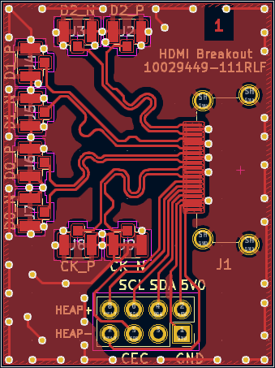
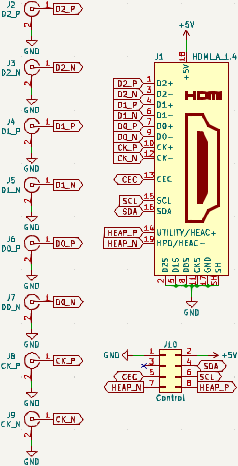
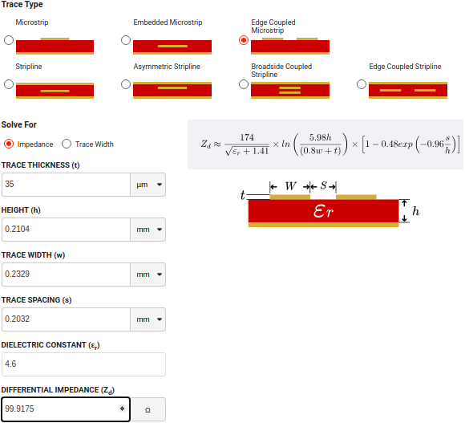

**Work-In-Progress**: [Gerbers ready](https://github.com/mwrnd/HDMI_Breakout/releases/tag/v0.1-alpha) but not yet ordered.

# HDMI Breakout

[HDMI](https://en.wikipedia.org/wiki/HDMI) to [U.FL/UMCC Connector](https://en.wikipedia.org/wiki/Hirose_U.FL) breakout.

# PCB Layout

All differential signals are length-matched to within 1mm, both inter-pair and intra-pair.

# Schematic

# PCB Layer Stackup

4-Layer PCB stackup taken from [JLCPCB](https://jlcpcb.com/capabilities/pcb-capabilities).

100-ohm Differential Impedance parameters were calculated using the [DigiKey Online Calculator](https://www.digikey.com/en/resources/conversion-calculators/conversion-calculator-pcb-trace-impedance).

